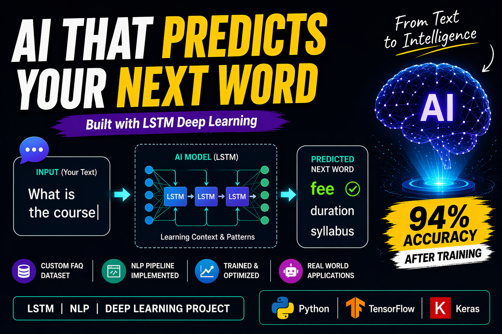

**<h1 align="center">🤖 PredictiveText AI: LSTM-Driven Word Forecasting System</h1>**

  

<h2>📌 Project Overview </h2>

PredictiveText AI is a deep learning-based project focused on Natural Language Processing (NLP). It is designed to intelligently predict the next word in a sentence by leveraging the capabilities of an LSTM (Long Short-Term Memory) network.

Instead of relying on generic text, the model is trained on a custom-built FAQ dataset, enabling it to capture realistic conversational patterns and understand how words relate to each other in context.

This project highlights how sequence models can power real-world applications such as:

Smart typing assistants (autocomplete)
Conversational AI systems
Automated text generation tools
Writing assistance platforms

<h2> 🚀 Core Highlights </h2>

* ✨ Sequence modeling using LSTM architecture
* 📚 Trained on structured FAQ-based data
* 🧠 Context-sensitive word prediction
* 📈 Noticeable improvement in performance during training
* ⚡ Lightweight implementation for easy execution
* 🔤 Mimics real-time autocomplete behavior

<h2> 🧠 Model Design </h2>

The system is built using a streamlined neural network pipeline:

Embedding → LSTM → Dense → Softmax

🔹 Process Flow

- Raw text is cleaned and tokenized
- Tokens are converted into numeric sequences
- Sequences are fed into the LSTM model
- The model generates probability scores for possible next words
- The most probable word is selected as output

<h2> 📊 Performance </h2>

<table>
  <tr>
    <th>🚀 Metric</th>
    <th>📈 Result</th>
  </tr>
  <tr>
    <td>Starting Accuracy</td>
    <td>~5%</td>
  </tr>
  <tr>
    <td>Final Accuracy</td>
    <td>~94%</td>
  </tr>
  <tr>
    <td>Training Epochs</td>
    <td>100</td>
  </tr>
  <tr>
    <td>Loss Function</td>
    <td>Categorical Crossentropy</td>
  </tr>
  <tr>
    <td>Optimizer</td>
    <td>Adam</td>
  </tr>
</table>

The dataset is built from a collection of FAQ-style content including:
* Course-related information
* Fee and subscription details
* Program structure
* Student support queries
* Administrative questions

This structured dataset helps the model learn natural conversational language, rather than random text sequences.

<h2> ⚙️ Technologies Used </h2>

- 🐍 Python
- 🔥 TensorFlow / Keras
- 📊 NumPy
- 🧠 NLP Tokenization Techniques
- 🔁 LSTM Neural Networks

<h2> 🔍 Sample Output </h2>

Input:
What is the course

Predicted Output:
fee / duration / syllabus

<h2> 📈 Working Pipeline </h2>

- Data cleaning and preprocessing
- Tokenization of text
- Sequence generation using sliding window approach
- Model training with LSTM
- Optimization using Adam
- Prediction via Softmax probability distribution

<h2> ▶️ Execution </h2>
python model.py

<h2> 📌 Dependencies </h2>

* tensorflow
* numpy
pandas
* keras
* matplotlib

<h2> 🚀 Future Scope </h2>

* 🌐 Build an interactive web app using Streamlit or Flask
* 🔥 Implement Beam Search for enhanced predictions
* 📚 Expand dataset for better generalization
* 🧠 Integrate Bidirectional LSTM
* 📱 Develop a mobile-friendly interface

